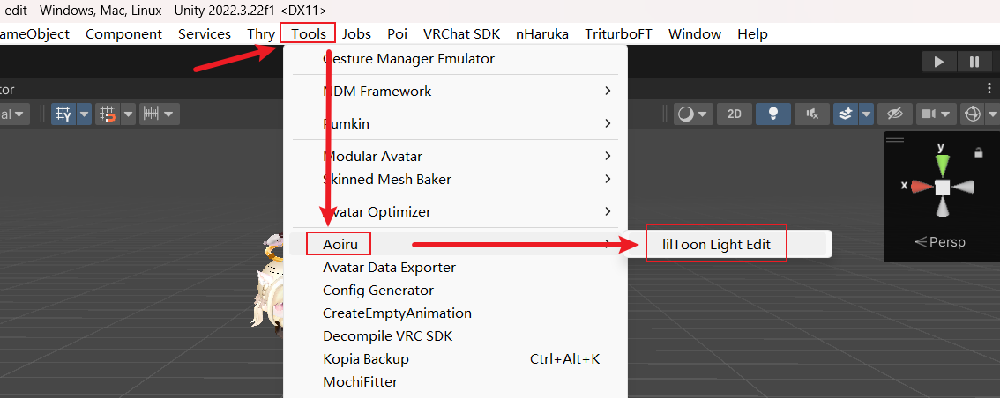
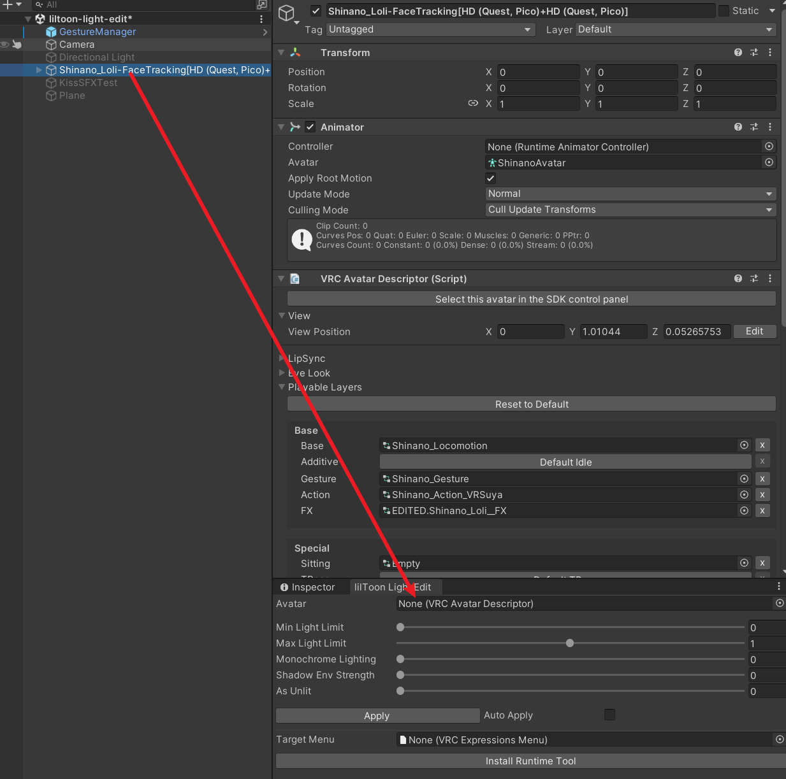
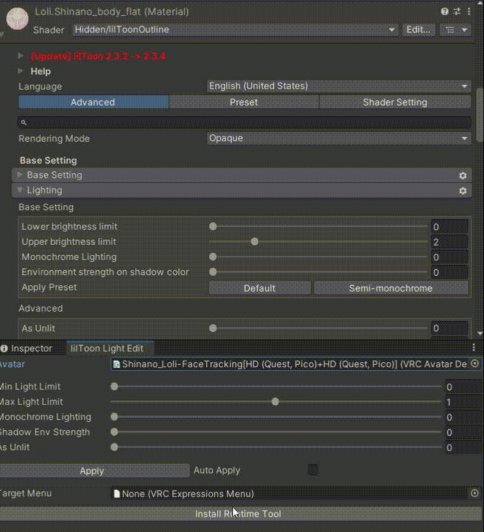
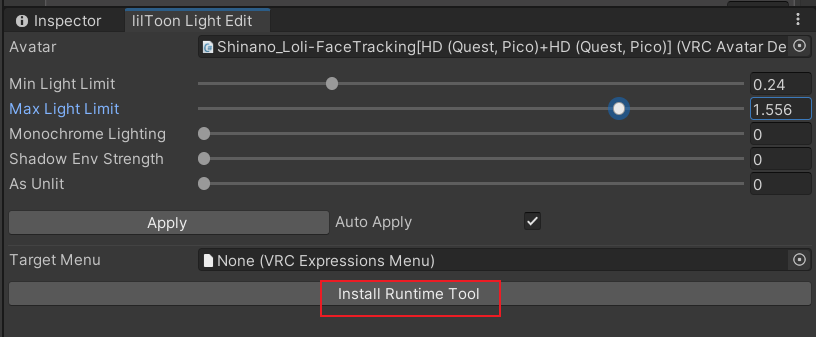
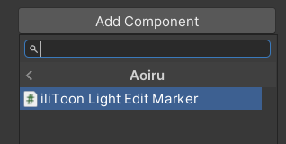
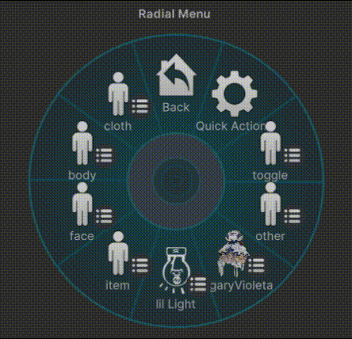

# lilToon Light Edit

A runtime light editing tool for VRChat players using lilToon shaders, providing:

- An editor window for batch-adjusting lighting settings on all lilToon materials across an avatar
- An NDMF (Non-Destructive Modular Framework) component that non-destructively adds an in-game menu for adjusting lilToon lighting at runtime

[Github](https://github.com/aoirusann/lilToonLightEdit)

## Installation

> Make sure your project already has [Modular Avatar](https://modular-avatar.nadena.dev/) installed.

#### Option 1: VCC One-Click

1. Click the button above. Your browser will prompt you to open VRChat Creator Companion — confirm and the repository will be registered automatically.
2. You can then add `lilToon Light Edit` to any Avatar project via "Manage Project" in VCC.

#### Option 2: UPM (git URL)

1. Open Unity, go to `Window → Package Manager`
2. Click `+` → `Add package from git URL...`
3. Enter: `https://github.com/aoirusann/lilToonLightEdit.git`
4. Click `Add`

## Usage

### Editor Window

Open `Tools/Aoiru/lilToon Light Edit`:

Drag your avatar into the `Avatar` slot:

Drag the sliders and click `Apply` to batch-edit lighting settings on all lilToon materials of the avatar. You can also enable `Auto Apply` to apply changes immediately as you drag:

### In-Game Adjustment

There are two ways to install the runtime menu:

1. Click `Install Runtime Tool` in the editor window (if a menu is set in `Target Menu`, the controls will be created as a submenu of that menu):  
   
2. Or add the component `Aoiru/lilToon Light Edit` to any GameObject under the avatar:  
   

The runtime menu works as shown below:

